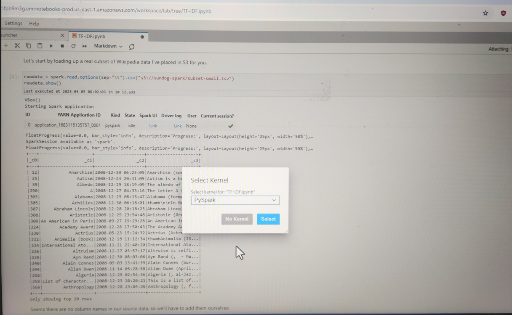

<h1>Preparing TF-IDF with spark and EMR studio</h1>

<h2>Description</h2>
In this lab,you'll be working with a raw dataset from wikipedia to build a custom TF-IDF(Term Frequency-Inverse Document Frequency) model.After cleaning the data and training the model, we applied it to perfrom a pseudo-search,retrieving meaningful results for a given term.using EMR(Elastic MapReduce),Utilizing:
- <b>EMR Workspace</b>
- <b>EMR Notebook running PySpark</b>
- <b>Within an EMR studio instance,supported by an EMR cluster</b>
The integration of these tools enables us to process and analyze the data efficiently at scale.
<br />


<h2>Languages and Utilities Used</h2>

- <b>EMF STUDIO</b> 
- <b>SPARK</b>
- <b>AWS CONSOLE
- <b>phyton </b>

<h2>Environments Used </h2>

- <b>Windows 10</b> (21H2)

<h2>Program walk-through:</h2>

<p align="center">
Launch EMR WORKSPACE Running PySpark: <br/>
 
<br />
<br />
Select the disk:  <br/>

<br />
<br />
Enter the number of passes: <br/>

<br />
<br />
Confirm your selection:  <br/>

<br />
<br />
Wait for process to complete (may take some time):  <br/>

<br />
<br />
Sanitization complete:  <br/>

<br />
<br />
Observe the wiped disk:  <br/>

</p>

<!--
 ```diff
- text in red
+ text in green
! text in orange
# text in gray
@@ text in purple (and bold)@@
```
--!>
